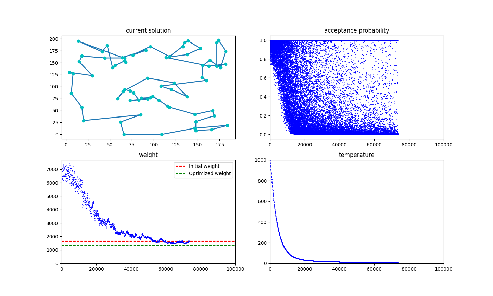

Visualisation of Simulated Annealing algorithm to solve the Travelling Salesman Problem in Python
=======

Forking from [jedrazb's repository](https://github.com/jedrazb/python-tsp-simulated-annealing.git), we added extra three graphies to demenstrate how the acceptance probability, temperature, and weight shift according to iteration. Other modifications, like the cooling strategy, can be found in the lastest commit.

Run 
>$ python3 tsp.py 

to start the program.

---

An example of current visualization result:

---

Followed by original README.

Using [simulated annealing](https://en.wikipedia.org/wiki/Simulated_annealing) metaheuristic to solve the [travelling salesman problem](https://en.wikipedia.org/wiki/Travelling_salesman_problem), and animating the results.

A simple implementation which provides decent results.

Requires [python3](https://docs.python.org/3/), [matplotlib](https://matplotlib.org/) and [numpy](http://www.numpy.org/) to work

--------

An example of the resulting route on a TSP with 70 nodes on 200x200 grid.

-------

An example of learning progress expressed as the distance of the path over the time

